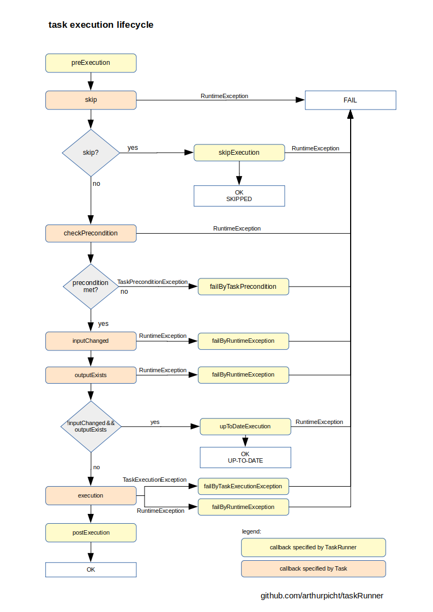

# taskRunner

A simple task runner with dependency management.

## Task execution lifecycle overview

## Some notes

### Task execution

* Tasks are identified by its name.
* A *description* is optional and can be used in calling functionality.
* Only tasks marked as *target* are executable.
* A task can have one or more dependencies specified by name. Cyclic dependencies
are not allowed and lead to an exception.

#### Skip

The *skip* function determines whether execution of task should be omitted.
The decision should be adopted on the basis of configuration and independently of
any task related business state. A skipped task will result in state *OK*.

#### Precondition

The *precondition* functions can check any condition that is necessary for a consistent
execution of the task. A thrown *TaskPreconditionException* will lead the respective task to be
finished as *FAILED*.

#### Up-To-Date-Check

The execution of a task can be omitted if the result state of that task is already given.
In order to check this conditions, two functions can be used: *InputChanged* and *OutputExists*.
A task that detects its status as up-to-date will result as *OK*.

##### InputChanged

The *InputChanged* function checks whether the input set of files or input entities for
the task is changed since the last execution of the task.

##### OutputExists

The *OutputExists* function checks for the respective task whether the output set of files
or output entities are existing.

|                           |  InputChanged == true  | InputChanged == false |
|---------------------------|:----------------------:|:---------------------:|
| **OutputExists == true**  |        EXECUTE         |      UP-TO-DATE       |
| **OutputExists == false** |        EXECUTE         |        EXECUTE        |

##### isUpToDate

In cases when just a single check is suitable to determine the up-to-date status, the
convenient function *isUpToDate* can be used, which is provided by the *TaskBuilder*.
When applying that, the specified function is passed through to *OutputExists*. Furthermore,
*InputChanged* is configured to return always false. 

